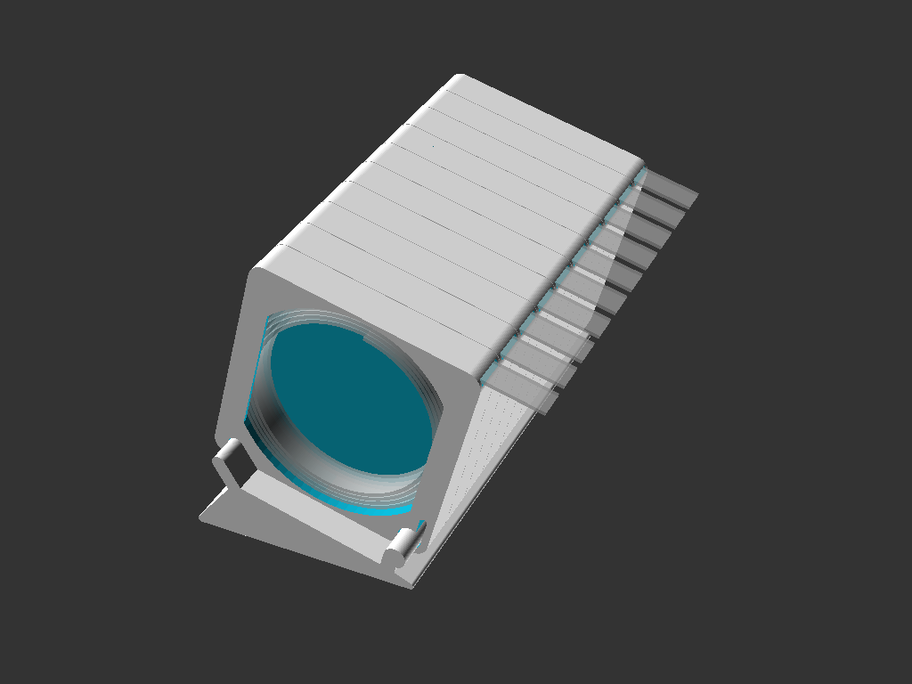

# SMDispenser

SMD component dispenser system.

  
  
  
  

See the first few variables at the top of the scad file to generate different sizes & options.

Some sample strip dimensions  
  strip_width = 8, 12, 16, 25, 33  
  strip_thickness = 1, 1.5, 2, 2.5, 3, 4  

Other options  
  spool_diameter = 60, 120  
  base_length = 60, 120 etc  
  spool_retainer_walls = true, false  

Disabling the retainer walls makes each caddy thinner and you can fit one more caddy on the base.  
This is also easier to print since there are no bridges.  
In this configuration the only thing containing the spool is the back of the next caddy, so there is an optional end cap for the left-most caddy.

  
  
